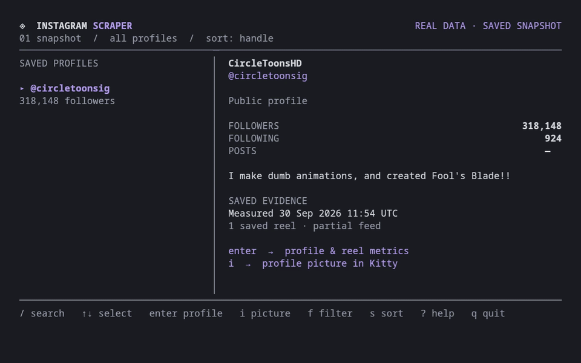

# Instagram Scraper

**Save raw Instagram profile and reel data. Explore it in your terminal.**

The Python collector saves profile metadata and reported counters as JSON. The
Go terminal viewer lets you search those saved snapshots, inspect profiles, and
browse reels offline. There is no AI analysis, scoring, or inferred demographics.
No backend, database, AI key, or Instagram developer API key is needed.

[](docs/demo.mp4?raw=1)

[Watch the demo](docs/demo.mp4?raw=1)
· [Recording instructions](docs/DEMO.md)

*The demo shows a saved public snapshot of [@circletoonsig](https://www.instagram.com/circletoonsig/)
and [this post](https://www.instagram.com/p/DdwMTTuMNnE/), including its avatar
and post thumbnail. Counts are observations from the saved timestamp, not live
totals. You can explore the snapshot without an Instagram account or capture.*

## 1. Install and try the offline demo

You need **Git and Go 1.26 or newer** to build the viewer. Collecting live data
also needs **Python 3.9 or newer and curl**. Python uses only its standard
library; there is nothing to install with pip.

On macOS with [Homebrew](https://brew.sh/):

```sh
brew install git go python curl
```

On Debian or Ubuntu, install the collector tools with:

```sh
sudo apt update
sudo apt install git python3 curl
```

On Linux, install Go 1.26+ using the [Go installation guide](https://go.dev/doc/install).
Other Linux distributions can install Git, Python, and curl with their package
manager. Check the versions before continuing:

```sh
git --version
go version
python3 --version
curl --version
```

Clone this repository, build the viewer, and open the included demo:

```sh
git clone https://github.com/pscyk/instagram-scraper.git
cd instagram-scraper
go build -o bin/instagram-scraper ./cmd/instagram-scraper
./bin/instagram-scraper --demo
```

Press **Enter** to inspect the saved `@circletoonsig` profile and its one
included post. In Kitty, press **i** for the avatar and **t** for the post
thumbnail; close each picture with **Enter or Esc**. Press **?** for help and
**q** to quit. The demo makes no Instagram requests and does not refresh counts.
Its `measured_at_utc` value records the observation time; use `--demo --json`
to inspect the saved data. One selected post does not represent the full feed.

## 2. Prepare your own session capture

Live collection requires an **existing, working captured cURL request from your
own authenticated Instagram mobile API session**. This project does not log in
with a password, obtain a capture for you, or refresh sessions automatically.

The capture must contain an `Authorization: Bearer …` header expressed with
cURL's `-H` option. Preserve the other headers from the working request,
including its user agent and any device/session headers. A captured `Cookie`
header can accompany them, but **a browser cookie jar, `cookies.json`, or a
`sessionid` cookie alone is unsupported**. Browser “Copy as cURL” output without
the required bearer header is insufficient.

See [the redacted example](examples/zebra_curls.redacted.sh) for the accepted
format. Its placeholders cannot authenticate. The collector reads the first
active cURL command, including backslash-continued lines, as text; **do not
execute or source the capture file**.

Keep your capture in an owner-only directory. Replace the source path below
with the text file containing your own captured request:

```sh
mkdir -p .secrets
chmod 700 .secrets
install -m 600 /path/to/your/captured-request.sh .secrets/capture.sh
```

The directory is private to your user, and the copied file is readable/writable
only by your user. Never commit or share session headers or cookies. `.secrets/`
and `results/` are ignored by Git; keep real captures and snapshots there.

Your local folder will look like this:

```text
instagram-scraper/
├── .secrets/
│   └── capture.sh          # Your private headers and cookies; never share
├── results/
│   ├── example.json        # Saved raw data; stays local
│   └── example.media/     # Optional downloaded pictures
└── ...                    # Public program source and attributed demo assets
```

Do not put your Instagram password in this project or create an `.env` file for
it: the collector accepts the captured session, not account passwords. If you do
not already have a working mobile API capture, you can still use `--demo` and
browse existing JSON snapshots. Acquiring that capture is a separate network
debugging step; this repository does not provide a password-login shortcut.

## 3. Collect a profile

Replace `example` with an Instagram handle, without `@` or a profile URL:

```sh
python3 lookup.py example \
  --capture .secrets/capture.sh \
  --max-pages 3 \
  --output results/example.json
```

The collector creates the output directory if needed. Progress goes to stderr;
the snapshot goes to `--output`, or to stdout when that flag is omitted.

Start with a small `--max-pages`: it limits feed pages, and each discovered reel
also needs a detail request. Reaching the page limit marks coverage incomplete.
The default is 100 pages. API requests run sequentially with a **minimum
one-second delay**; use `--delay 2` to slow them down further. Run only one
collector at a time for each captured session, because separate processes do
not share a rate limiter.

### Optional: save pictures for Kitty

Add `--download-images` to save a profile avatar and up to **12 reel thumbnails
by default**. This option requires `--output`:

```sh
python3 lookup.py example \
  --capture .secrets/capture.sh \
  --max-pages 3 \
  --download-images \
  --thumbnail-limit 12 \
  --output results/example.json
```

`--thumbnail-limit` accepts 0–100; zero collects only the available avatar.
Pictures are saved as local PNG/JPEG files in `results/example.media/`, with
relative paths recorded in the JSON. Image downloads use allowed CDN hosts
without your session headers. Missing URLs or failed downloads leave the raw
metrics usable; an unavailable image does not stop the snapshot from being saved.

### If collection stops

HTTP errors stop the lookup without a retry loop. For an expired or challenged
session, check your account in the Instagram app, complete its normal account
flow, then replace `.secrets/capture.sh` with a fresh working capture and keep
its permissions at `600`. There is no automatic login or session replacement.

If you see `Capture has no bearer authorization header`, check the capture
format and its `-H` headers; a browser-cookie export cannot substitute for the
required mobile API capture. After a rate-limit response, pause collection
instead of repeatedly restarting it. Only collect data your session can access.

## 4. Browse your saved data

Open one snapshot or all snapshots directly inside a directory:

```sh
./bin/instagram-scraper --input results/example.json
./bin/instagram-scraper --input results
```

To print the loaded snapshots as JSON without opening the interactive viewer:

```sh
./bin/instagram-scraper --input results --json
./bin/instagram-scraper --demo --json
```

The viewer reads local files only. It never contacts Instagram, reads your
capture, or starts collection. You can copy saved snapshots to another machine
and inspect them there; copy their `.media/` directories too if you want pictures.

| Key | Action |
| --- | --- |
| `↑` / `↓` or `k` / `j` | Select a profile; scroll when viewing its details |
| `Enter` | Open the selected profile |
| `/` | Search profiles |
| `f` / `s` / `c` | Cycle filter / cycle sort / clear both and search |
| `[` / `]` | Previous / next profile |
| `n` / `p` | Next / previous reel in a profile's details |
| `i` / `t` | Preview the avatar / selected reel thumbnail in Kitty |
| `Esc` | Return from details or help |
| `?` / `q` | Show help / quit |

For image previews, run the viewer in [Kitty](https://sw.kovidgoyal.net/kitty/)
with its `kitten` helper available. Press **Enter or Esc** to close a picture and return
to the viewer. Other terminals can still browse the text and metrics.

Install Kitty using its [official installation guide](https://sw.kovidgoyal.net/kitty/binary/).
On macOS, the manual option is to download its DMG and install the app in
`/Applications`; this viewer can find the bundled helper there. On Linux, use
the official installation instructions or your distribution's package, and
check that `kitten --version` works. Open the Kitty application, `cd` into the
cloned repository, and run `./bin/instagram-scraper --demo` to try the pictures.

Pictures come only from local `profile.avatar_path` and
`ranked_reels[].thumbnail_path` entries, resolved relative to the snapshot.
The viewer does not fetch remote image URLs. Missing or unsupported pictures
produce a message while the saved data remains available.

Previews accept PNG/JPEG files up to 4 MiB and 2048 × 2048 pixels. Use an actual
Kitty window for pictures; the text interface also works in other terminals.

### Common setup problems

| Message or symptom | What to do |
| --- | --- |
| `go: command not found` | Install Go, reopen your terminal, and check `go version`. |
| Capture file not found | Run from the repository directory or pass an absolute path with `--capture`. |
| Missing bearer authorization | Use a working mobile API capture with `-H 'Authorization: Bearer …'`; a browser cookie file alone will not work. |
| HTTP 401/403 or a rejected session | Check the account in Instagram, then replace the capture with a fresh one. Do not post it in an issue. |
| HTTP 429 | Stop and allow the rate limit to recover; keep one collector per session and increase `--delay`. |
| No cached image | Recollect with `--download-images`; an upstream image may also be unavailable. |
| Images require Kitty | Open Kitty and run the same viewer command there. |
| Interactive mode requires a terminal | Run the command directly in a terminal, or use `--json` when piping output. |
| No JSON snapshots found | Point `--input` at the JSON file or its containing directory, not the `.media/` folder. |

## What the numbers mean

| Saved data | Examples |
| --- | --- |
| Profile | Handle, name, biography, website, privacy/verification flags, followers, following, post count |
| Reels | Caption, URL, publication time, duration, reported plays, likes, comments, reshares, reposts |
| Coverage | Capture time, scanned posts, checked reels, complete/truncated feed, missing play counts |

Missing counts remain **unknown** (`null`); measured zero remains **0**. Reels
are sorted by reported `play_count`, with missing counts last. Plays are not
unique viewers. Reach, saves, watch time, and audience demographics are not
invented when the response does not provide them.

See [METRICS.md](METRICS.md) for field meanings and coverage limits. Instagram's
undocumented responses can change; this is not an official Instagram API client.

## Development

```sh
python3 -m unittest discover -s tests -v
go test -race ./...
go vet ./...
go build ./cmd/instagram-scraper
```

Tests use local fixtures, including synthetic cases and the bundled snapshot,
and make no Instagram requests. The viewer uses [Charm](https://charm.land/)'s Bubble Tea, Bubbles, and Lip Gloss. Demo recording
instructions are in [docs/DEMO.md](docs/DEMO.md).

## License

The source code is [MIT licensed](LICENSE). The public demo includes material
from [@circletoonsig](https://www.instagram.com/circletoonsig/); Instagram images
and post content remain the material of their respective owners and are not
relicensed under MIT. See [demo attribution](docs/ATTRIBUTION.md).
